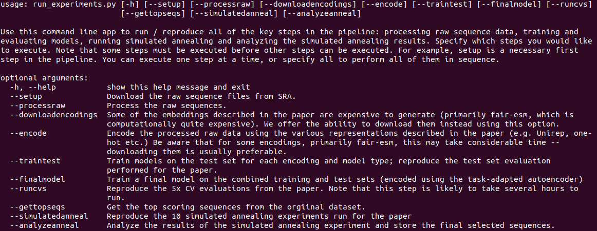

# In_silico_directed_evolution
This repo contains the code used to generate the results from Parkinson / Hard et al.
2022.

- [Installation](#Installation)
- [Usage](#Usage)

### Installation

This code was originally run on a Linux x86_64 machine with a GTX1070 Nvidia GPU
and has not been tested on other platforms at this time. Although it should in 
principle work on other platforms, it is primarily intended for use on Linux.

To install, first create and activate a Python virtual environment,
then run the following from your terminal:

```
git clone https://github.com/jlparkI/In_silico_directed_evolution
cd In_silico_directed_evolution
pip install -r requirements.txt
```

The most common cause of issues in our experience involves problems with the 
CUDA installation and/or the version of PyTorch. You may need to install a 
different version of PyTorch than the one we have here depending on your CUDA
version etc.

### Usage

To reproduce any of the experiments of interest from the pipeline, you need only
run the *run_experiments.py* script. If you do so without specifying any arguments, 
you'll see the following screen:




which essentially provides a menu of experiments you can run. Note that some of these
obviously must be run before others (for example, data must be encoded before a model
can be trained etc). Pretrained models are provided so that the models do not need
to be retrained unless desired.

Note that processing and encoding the raw read data is time-consuming and (for
some of the encoding types we tested) computationally expensive. We highly recommend
downloading the pre-encoded data instead.

### Raw data storage

The raw read data is available on SRA. If any difficulties are encountered in
accessing the raw data, it can also be retrieved from
[this dropbox link](https://www.dropbox.com/sh/2iyxmsljo551cwy/AACetM27l1CbiIy7NV6a4mNra?dl=0).

When downloading the raw data, you will find a tarball containing encoded data and three folders named
rh01, rh02 and rh03. Extract the encoded data file and move the
contents of the resulting folder to the encoded data folder in
this directory. Move the three folders to the raw_data folder in
this directory. You should then be able to proceed (and do not need
to run downloadencodings or setup).


### Citations

If using any of the code in this repository, please cite:

Parkinson, J., Hard, R. & Wang, W. The RESP AI model accelerates the identification of tight-binding antibodies.
Nat Commun 14, 454 (2023). https://doi.org/10.1038/s41467-023-36028-8
